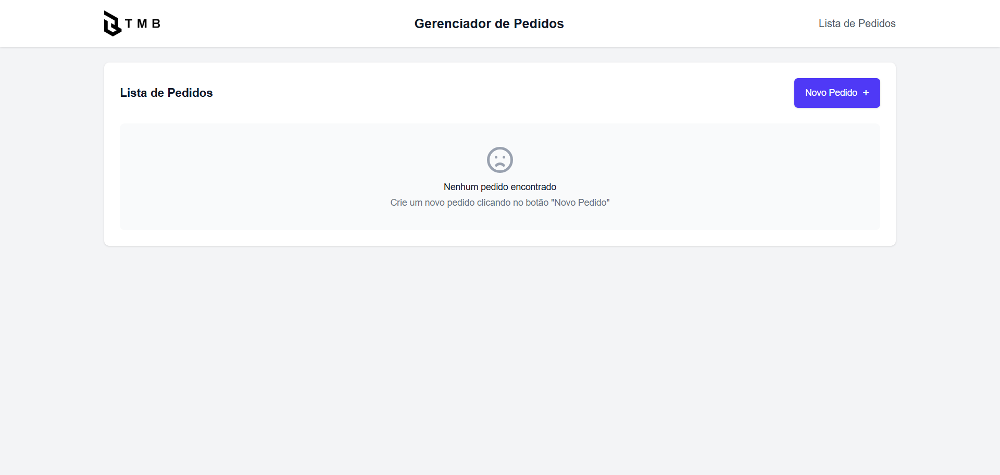
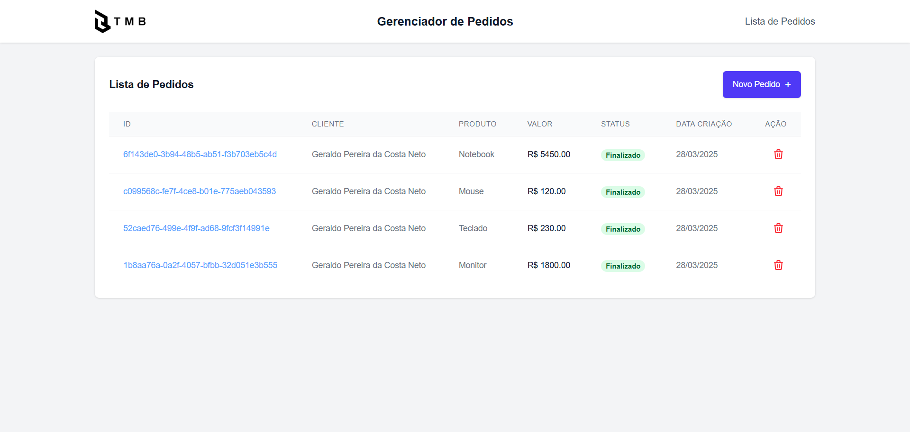
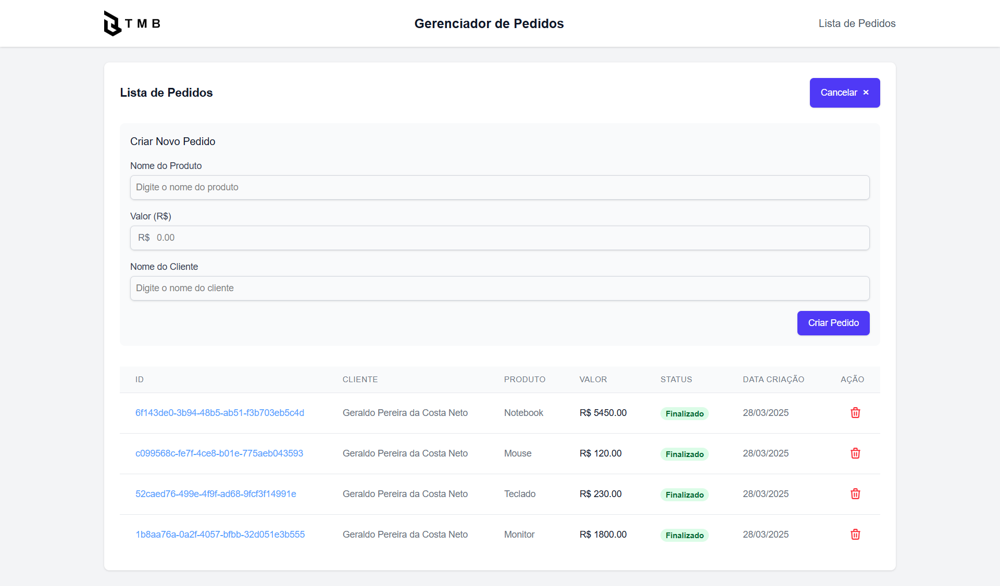
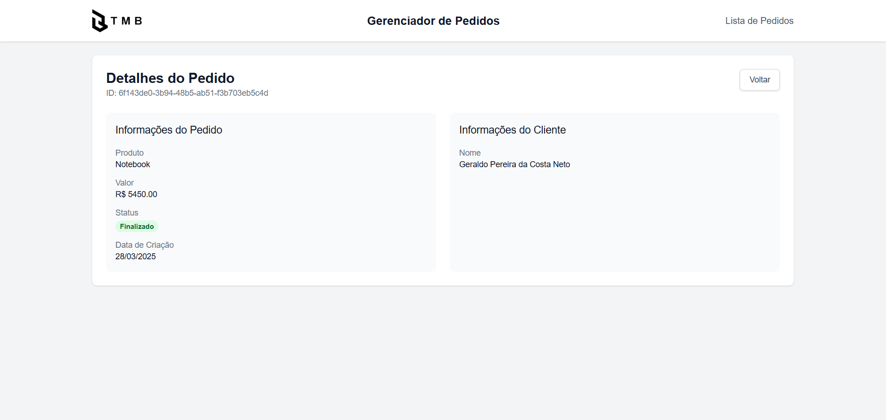
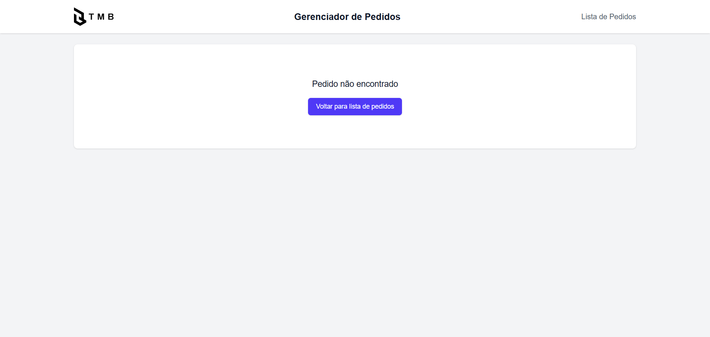
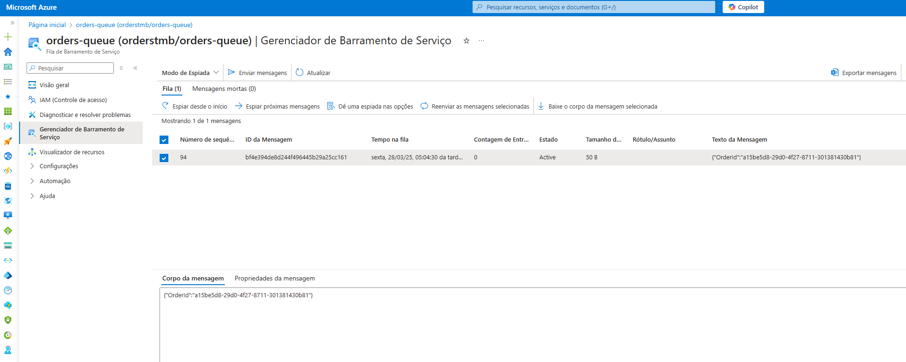

## 📌 Visão do Projeto

Este projeto é uma POC que implementa um sistema completo de gerenciamento de pedidos com as seguintes características:

- **Arquitetura moderna**: Frontend em React com Tailwind CSS e backend em .NET Core
- **Comunicação em tempo real**: Utiliza SignalR para atualização automática do status dos pedidos
- **Processamento assíncrono**: Integração com Azure Service Bus para tratamento de mensagens
- **Experiência dinâmica**: Atualizações automáticas da interface sem necessidade de refresh

O sistema demonstra:<br>
✔ Fluxo completo de um pedido (criação → processamento → conclusão)  
✔ Notificações em tempo real para todas as mudanças de status  
✔ Escalabilidade no processamento de pedidos via Service Bus  
✔ Interface responsiva e moderna com Tailwind CSS

### Backend
- .NET Core
- Entity Framework Core com Postgress
- SignalR
- Azure Service Bus 
- Docker

### Frontend
- React
- Tailwind CSS
- SignalR Client
- Axios (para requisições HTTP)
- Docker

## ⚙️ Pré-requisitos

Antes de executar o projeto, certifique-se de ter instalado:
- [Docker](https://www.docker.com/get-started)
- [Docker Compose](https://docs.docker.com/compose/install/)
- Git (opcional, para clonar o repositório)


## 🚀 Como Executar o Projeto

Siga estes passos para executar a aplicação:

1. **Clone o repositório** (ou baixe o código fonte):
   ```bash
   git clone https://github.com/seu-usuario/Poc-TMB.git
   
   cd Poc-TMB
2. **Dentro da pasta Poc_TMB Execute os containers com Docker Compose**
   ```bash
   docker-compose up --build
3. **Acesse a aplicação disponível em**
   ```bash
   http://localhost:3000
4. **Acesse o swagger da API disponível em**
   ```bash
   http://localhost:5000/swagger
5. **Para parar a aplicação pressione `Ctrl+C` ou execute**
   ```bash
   docker-compose down
## 🔄 Processo Automático

- ✅ Build das imagens Docker
- ✅ Aplicação das migrations do EF no banco Postgress
- ✅ Configuração do banco de dados
- ✅ Inicialização dos serviços conectados

## 🎥 DEMO
<video src="Prints/DEMO.mp4" controls width="100%">
Seu navegador não suporta a tag <code>video</code>.
</video>

## Prints do projeto







